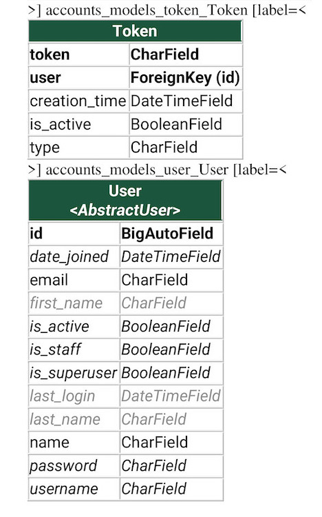

# RSS Reader

### Purpose
This application serves users with RSS feed data.
### Prerequisites
Python 3.11.4
Docker
Docker Compose
### How to run
1. Clone the repo on your machine
2. Set your environment file (see next section)
3. Initialize
4. Run the dependency docker containers:
```
docker-compose up -d redis mongo postgres
```
5. Initialize Postgres and Mongo with their databases, users and collections
6. Run the application container:
```
docker-compose up -d rss_reader
```
7. To run the application's unit tests, use the following command:
```
python3 manage.py test
```
### Environment File
This application requires setting up environment variables as follows:
	- Create a `.env` file next to the `docker-compose.yml` file
	- Add the following after you set the values for the placeholders <>:
```
SECRET_KEY=<django-secret-key>
ALLOWED_HOSTS=*
POSTGRES_NAME=<postgres-db-name>
POSTGRES_USER=<postgres-user>
POSTGRES_PASSWORD=<postgres-password>
REDIS_HOST=<redis-ip>
POSTGRES_HOST=<postgres-ip>
POSTGRES_PORT=5432
MONGO_DB_HOST=<mongo-ip>
MONGO_DB_PORT=27017
MONGO_DB_USERNAME=<mongo-username>
MONGO_DB_PASSWORD=<mongo-password>
MONGO_DB_NAME=<mongo-db-name>
DEBUG=<1-or-0>
```
### Authentication
- All endpoints (except login, refresh, register and schema) require an access token to authenticate the user
- The access token shall be attached in the request headers as follows:
	- `Authorization: Bearer <access-token>`

### Endpoints
- Register
	- Registers a user using their email and password
- Login
	- User logs in with email and password to generate a token pair
- Refresh API
	- User uses refresh token to create a new token pair
- Follow Feed
	- User follows a specific RSS feed
- Unfollow Feed
	- User unfollows a specific RSS feed
- Get Feeds API
	- Fetches all feeds and their info
- Get Posts
	- Fetches all posts and their data
	- filter by:
		- Posts that are already read
		- Posts from a specific feed
		- Post from feeds followed by user
- Set post read status
	- User sets post as read/unread
- Refresh Feed
	- Force refresh a certain feed, refetching its data

### Design Decisions
- I used a layered architecture for building endpoints. Layers are
	- View
	- Serializer (data validation)
	- Interface (business logic)
	- Models (data access)
- RSS data is divided in two databases:
	- Postgres: to handle and manage relations between users, feeds and posts
	- MongoDB to store post data, mainly because:
		- Post data is not structured
		- Post data can be large in size
	- Mongo post document stores Post PK and Post data fetched from the RSS service
- Why use Celery?
	- Celery is arguably the most production-ready solution for background tasks as of today.
- Why not use asynchronous programming?
	- It would have definitely had a great impact on performance
	- Problem was that AsyncIO is not supported by any of the following:
		- Django ORM
		- Celery
		- Django REST Framework
	- The only major bottleneck that can affect the end-user is fetching posts, which is mitigated by implemented pagination
- Posts API returns post data paginated:
	- This is done to prevent performance issues, since we need to fetch the data of each post from the mongo database separately
	- The default page size is 10
- Some functionalities are implemented manually (authentication, pagination, etc.)
	- This is a personal preference, as it allows the developer more control over their business logic
- Each API is versioned as per semantic versioning (major.minor.path)
	- API version is found in the URL
- Login API returns an access and refresh token
	- Access token expires after 10 mins
	- Refresh token expires after 30 mins, and can be used to generate a new token pair, instead of the user having to login again
- The background task is run every 1 minutes, and processes the feeds that are due to be processed
- Back-off mechanism is implemented in the RSSProcessor class
- Unit tests are done for the RSSProcessor, and for each endpoint provided by the application.
- The application container has 3 dependencies: Postgres, Redis & Mongodb

### OpenAPI Specifications:
You can access the OpenAPI specifications for the endpoints through a public endpoint: `http://<application-host/schema/`
You can find it below as well:
```
openapi: 3.0.2
info:
  title: ''
  version: ''
paths:
  /api/v1/feed/list/:
    get:
      operationId: retrieveList
      description: ''
      parameters: 
        - in: header
          name: Authorization
          description: Bearer <access-token>
          schema:
            type: string
      responses:
        '200':
          content:
            application/json:
              schema:
                $ref: '#/components/schemas/ListResponse'
          description: ''
        '422':
          content:
            application/json:
              schema:
                $ref: '#/components/schemas/ErrorResponse'
          description: ''
      tags:
      - api
  /api/v1/feed/follow/:
    post:
      operationId: createFollow
      description: ''
      parameters: 
        - in: header
          name: Authorization
          description: Bearer <access-token>
          schema:
            type: string
      requestBody:
        content:
          application/json:
            schema:
              $ref: '#/components/schemas/FollowRequest'
      responses:
        '200':
          content:
            application/json:
              schema:
                $ref: '#/components/schemas/FollowResponse'
          description: ''
        '422':
          content:
            application/json:
              schema:
                $ref: '#/components/schemas/ErrorResponse'
          description: ''
      tags:
      - api
  /api/v1/feed/posts/:
    post:
      operationId: createPosts
      description: ''
      parameters: 
        - in: header
          name: Authorization
          description: Bearer <access-token>
          schema:
            type: string
      requestBody:
        content:
          application/json:
            schema:
              $ref: '#/components/schemas/PostsRequest'
      responses:
        '200':
          content:
            application/json:
              schema:
                $ref: '#/components/schemas/PostsResponse'
          description: ''
        '422':
          content:
            application/json:
              schema:
                $ref: '#/components/schemas/ErrorResponse'
          description: ''
      tags:
      - api
  /api/v1/feed/post-read-status/:
    post:
      operationId: createPostReadStatus
      description: ''
      parameters: 
        - in: header
          name: Authorization
          description: Bearer <access-token>
          schema:
            type: string
      requestBody:
        content:
          application/json:
            schema:
              $ref: '#/components/schemas/PostReadStatusRequest'
      responses:
        '200':
          content:
            application/json:
              schema:
                $ref: '#/components/schemas/PostReadStatusResponse'
          description: ''
        '422':
          content:
            application/json:
              schema:
                $ref: '#/components/schemas/ErrorResponse'
          description: ''
      tags:
      - api
  /api/v1/feed/refresh/:
    post:
      operationId: createRefresh
      description: ''
      parameters: 
        - in: header
          name: Authorization
          description: Bearer <access-token>
          schema:
            type: string
      requestBody:
        content:
          application/json:
            schema:
              $ref: '#/components/schemas/RefreshRequest'
      responses:
        '200':
          content:
            application/json:
              schema:
                $ref: '#/components/schemas/RefreshResponse'
          description: ''
        '422':
          content:
            application/json:
              schema:
                $ref: '#/components/schemas/ErrorResponse'
          description: ''
      tags:
      - api
  /api/v1/feed/unfollow/:
    post:
      operationId: createUnfollow
      description: ''
      parameters: 
        - in: header
          name: Authorization
          description: Bearer <access-token>
          schema:
            type: string
      requestBody:
        content:
          application/json:
            schema:
              $ref: '#/components/schemas/UnfollowRequest'
      responses:
        '200':
          content:
            application/json:
              schema:
                $ref: '#/components/schemas/UnfollowResponse'
          description: ''
        '422':
          content:
            application/json:
              schema:
                $ref: '#/components/schemas/ErrorResponse'
          description: ''
      tags:
      - api
  /api/v1/user/login/:
    post:
      operationId: createLogin
      description: ''
      parameters: []
      requestBody:
        content:
          application/json:
            schema:
              $ref: '#/components/schemas/LoginRequest'
      responses:
        '200':
          content:
            application/json:
              schema:
                $ref: '#/components/schemas/LoginResponse'
          description: ''
        '422':
          content:
            application/json:
              schema:
                $ref: '#/components/schemas/ErrorResponse'
          description: ''
      tags:
      - api
  /api/v1/user/refresh-token/:
    post:
      operationId: createRefreshToken
      description: ''
      parameters: []
      requestBody:
        content:
          application/json:
            schema:
              $ref: '#/components/schemas/RefreshTokenRequest'
      responses:
        '200':
          content:
            application/json:
              schema:
                $ref: '#/components/schemas/RefreshTokenResponse'
          description: ''
        '422':
          content:
            application/json:
              schema:
                $ref: '#/components/schemas/ErrorResponse'
          description: ''
      tags:
      - api
  /api/v1/user/register/:
    post:
      operationId: createRegister
      description: ''
      parameters: []
      requestBody:
        content:
          application/json:
            schema:
              $ref: '#/components/schemas/RegisterRequest'
      responses:
        '200':
          content:
            application/json:
              schema:
                $ref: '#/components/schemas/RegisterResponse'
          description: ''
        '422':
          content:
            application/json:
              schema:
                $ref: '#/components/schemas/ErrorResponse'
          description: ''
      tags:
      - api
components:
  schemas:
    ListResponse:
      type: object
      properties:
        feeds:
          type: array
          items:
            type: object
      required:
      - feeds
    FollowRequest:
      type: object
      properties:
        pk:
          type: integer
      required:
      - pk
    FollowResponse:
      type: object
    PostsRequest:
      type: object
      properties:
        feed_pk:
          type: integer
        is_read:
          type: boolean
        is_feed_followed:
          type: boolean
        page:
          type: integer
        page_size:
          type: integer
    PostsResponse:
      type: object
      properties:
        posts:
          type: array
          items:
            type: object
        total_size:
          type: integer
      required:
      - posts
      - total_size
    PostReadStatusRequest:
      type: object
      properties:
        pk:
          type: integer
        is_read:
          type: boolean
      required:
      - pk
      - is_read
    PostReadStatusResponse:
      type: object
    RefreshRequest:
      type: object
      properties:
        pk:
          type: integer
      required:
      - pk
    RefreshResponse:
      type: object
    RefreshTokenRequest:
      type: object
      properties:
        refresh_token:
          type: string
      required:
      - refresh_token
    RefreshTokenResponse:
      type: object
      properties:
        access_token:
          type: string
        refresh_token:
          type: string
      required:
      - access_token
      - refresh_token
    UnfollowRequest:
      type: object
      properties:
        pk:
          type: integer
      required:
      - pk
    UnfollowResponse:
      type: object
    LoginRequest:
      type: object
      properties:
        email:
          type: string
        password:
          type: string
      required:
      - email
      - password
    LoginResponse:
      type: object
      properties:
        access_token:
          type: string
        refresh_token:
          type: string
      required:
      - access_token
      - refresh_token
    RegisterRequest:
      type: object
      properties:
        email:
          type: string
        password:
          type: string
      required:
      - email
      - password
    RegisterResponse:
      type: object
    ErrorResponse:
      type: object
      properties:
        message:
          type: string
      required:
      - message
```

### Database Schema


